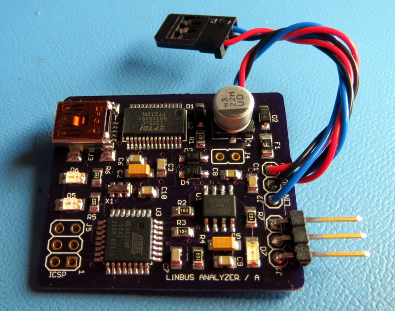
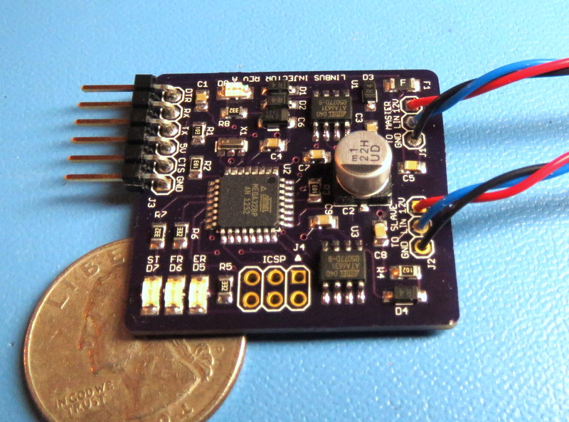

ARDUINO LINBUS GADGETS
======================

An Arduino based LINBUS stack that allow to explore and hack linbus based system.

Unless specified otherwise, the PCBs can be used with standard Aruduino IDE, behaving as Arduino Pro Mini 5V 16Mhz with ATMEGA328.

 
**Analyzer** - a small PCB that connects on one hand to linbus and to a computer USB port on the other. The analyzer decode all the linbus frames and dump them to the computer. The USB connection emulates a serial port using a builtin FTDI adapter and can be read with standard serial application. A special python script is provided in the tools directory to dump the serial data in diff mode such that only changed bits are displayed. The board design support also linbus TX which allow to have this board functioning as a linbus master or slave (this however requires firmware changes).

 
**Beeper** - a small PCB and firmware that monitors a linbus and activates a buzzer when certain conditions met. The provided firmware includes a car specific example that beeps when the reverse gear in my car is engaged. The car specific logic is in the car_module* files and can be adapted to different applications.

 
**Injector** - a small PCB board with two linbus interfaces that connects in series between a linbus master and a linbus slave. The injector looks as a slave to the master and as a master to slave and it transparantly proxying LIN frame between the. At the same time, it can monitor bus signals, apply application spefici logic and can inject signals back to the bus by modifying on the fly LIN frames it proxys between the master and the slave. The Injector was developed to modiy the behavior of existing LIN bus based system (e.g. automatic activation of the Sport mode in my car).

 
**Feature Comparison**

| Feature | Analyzer | Beeper | Injector |
|----|----|----|----|
| Max LIN speed | 20kps | 20kps | 20kps |
| Min LIN speed | 1kps | 1kps | 1kps |
| LIN frame dump/log | Yes | Yes | Yes |
| Supported LIN checksums | V1/V2 | V1/V2 | V1/V2 |
| Computer serial interface | FTDI/USB | Serial 5V | Serial 5V |
| Computer serial speed | 115,200 | 115,200 | 115,200 |
| Audible output | No | Yes | No |
| LIN signal interception | Yes | Yes | Yes |
| LIN signal injection | No j No | Yes |
| Arduino IDE compatible | Yes | Yes | Yes |
| Programming language | C/C++ | C/C++ | C/C++ |
| MCU | ATMEGA328P | ATMEGA328P  | ATMEGA328P |
| MCU speed | 16Mhz | 16Mhz  | 16Mhz |
| Schematic/Layout software | Cadsoft Eagle | Cadsoft Eagle | Cadsoft Eagle |
| PCB Size (inches) | 1.3 x 1.5 | 1.15 x 1.6 | 1.31 x 1.44 |
| PCB layers | 2 | 2 | 2 |
| OSHPark compatible | Yes | Yes | Yes |

